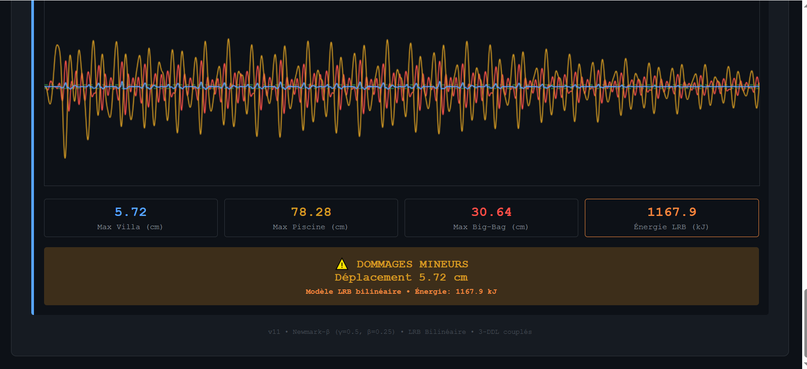

🏗️ Sisimic

**Seismic building response simulator** with tuned mass damper (TMD) and base isolation systems.

▶️ [Lancer l'application](index2.html)

## 🚀 Features

- **Multi-story Building Model** — Realistic mass-spring-damper system
- **Tuned Mass Damper (TMD)** — Passive vibration control simulation
- **Base Isolation (LRB)** — Lead rubber bearing simulation
- **Real-time Visualization** — Animated building response
- **Earthquake Input** — Various ground motion profiles
- **Parameter Adjustment** — Tune TMD frequency, damping, mass ratio

## 🛠️ Tech Stack

- Pure HTML/CSS/JavaScript
- Canvas-based animation
- Numerical integration (Newmark-β)
- No external dependencies

## 📖 Usage

1. Open \`index.html\` in your browser
2. Configure building parameters (floors, stiffness, damping)
3. Enable/disable TMD or base isolation
4. Select earthquake profile
5. Click **Start** to run simulation

## 🎓 Educational Purpose

Learn structural dynamics concepts:
- Natural frequency and mode shapes
- Resonance and amplification
- Passive vs. active vibration control
- Seismic isolation principles

## 📄 License

MIT

## 👤 Author

**Eric PERRET** — [GitHub](https://github.com/ericperret)
